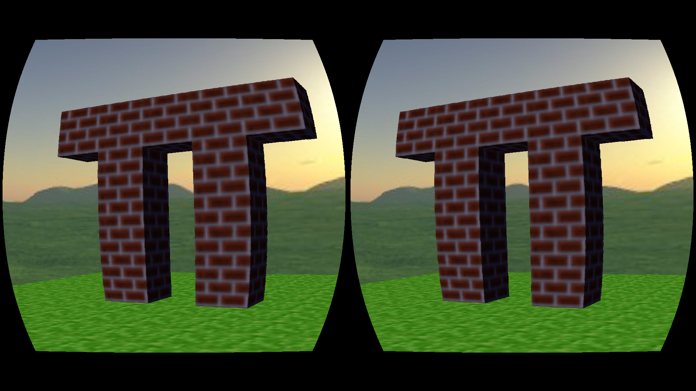
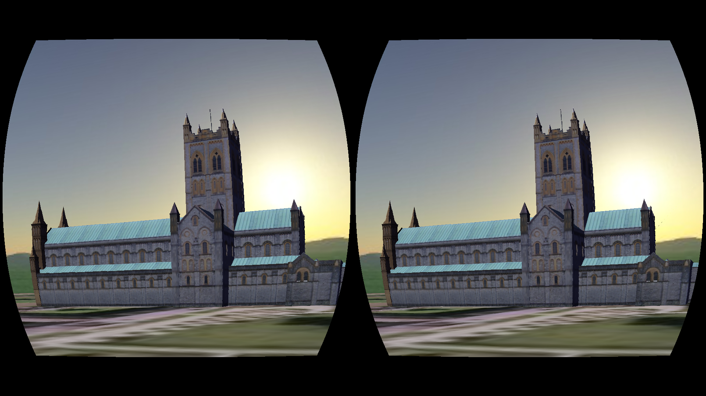
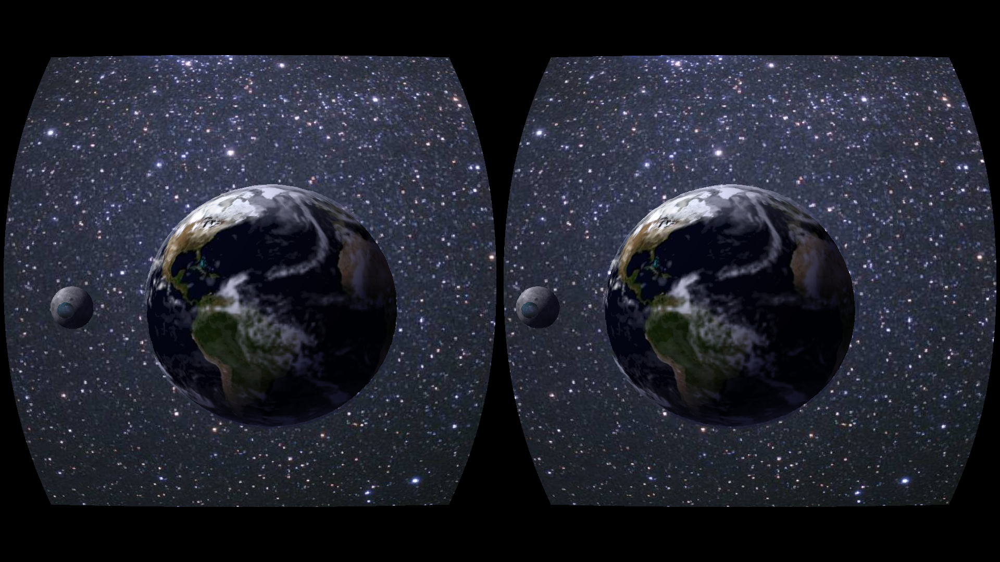
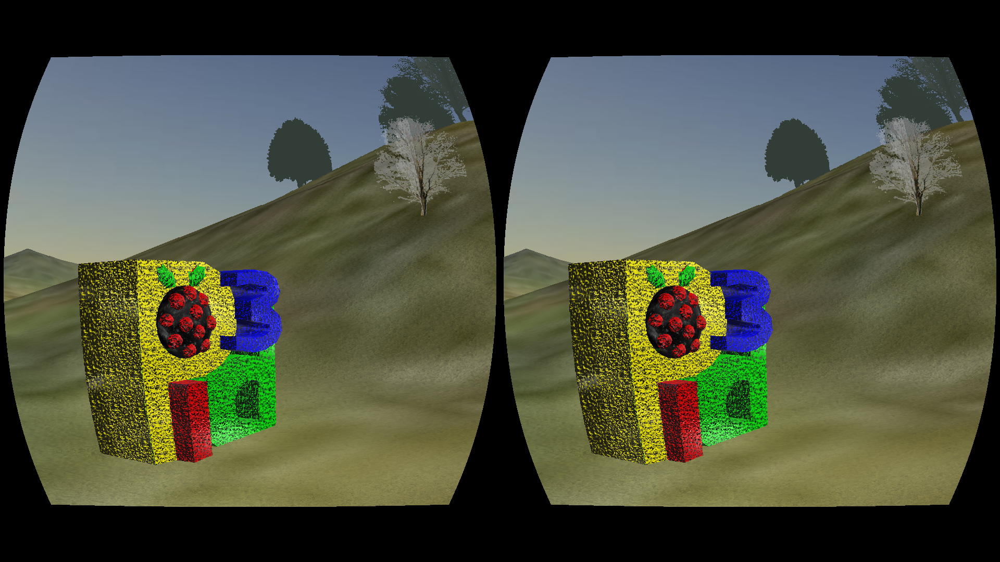
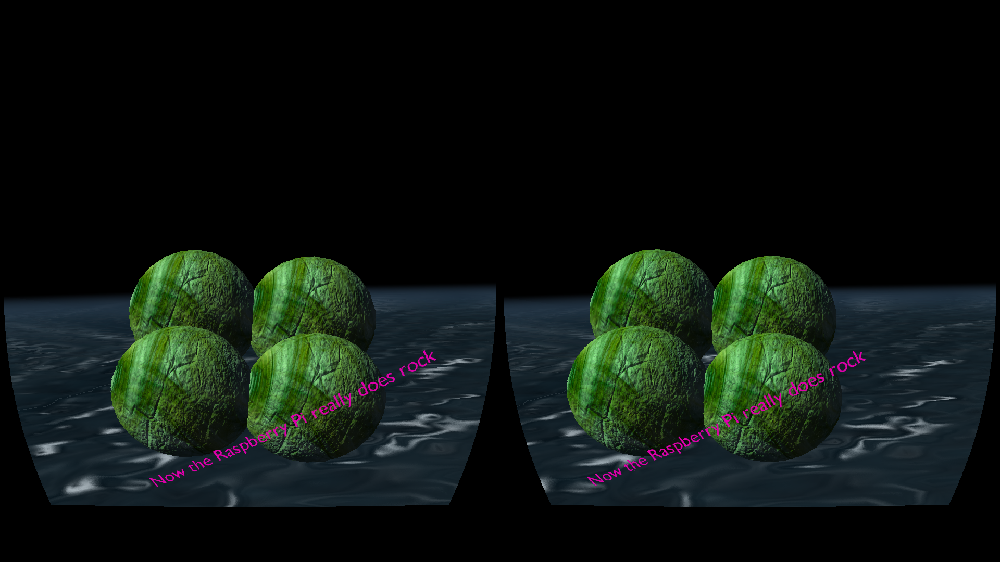

# VR Zero
---

Virtual Reality development on the Raspberry Pi, in Python.

Created by [Wayne Keenan](https://twitter.com/wkeenan) of [The Bubbleworks](https://www.thebubbleworks.com/).

Status: *** Experimental ***



---

# About

A (hopefully) frictionless way to get started creating your own virtual reality worlds in Python on a Raspberry Pi with an Oculus Rift.

VR Zero adds a number of features on top of [pi3d](https://pi3d.github.io) and solves the headaches of configuring a Pi 3 for VR development in Python.

VR Zero includes:

- Default input event handling for Keyboard, Mouse, Joypad and the PSVR for moving and altering the view of the player avatar.
- Known good HDMI configuration settings for the Oculus Rift DK1 and DK2.
- Python bindings for the native OpenHMD library with supporting udev config for non-root access to USB device
- An OpenGL ES barrel shader for correcting lens distortion (as can be found in official Oculus SDK's)
- XBox Joypad configuration.
- A handful of VR demos (screenshots and a video of the demos can be found below).

VR Zero is for fun and learning, so don't expect huge gaming PC like frame rates, some demos peak at around 25-30 FPS on a Pi 3.

The API will in no doubt change, boiler plate code may lessen, faster Pi hardware will be released and HMD's will get cheaper... (hopefully)  :)

Further development will be guided by end user feedback, so *** please raise a [bug](https://github.com/WayneKeenan/python-vrzero/issues/new?labels=bug)
or [enhancement](https://github.com/WayneKeenan/python-vrzero/issues/new?labels=enhancement) request. ***


---

# Example Code

Below is some example bare-bones code:

```python
from vrzero import engine
import pi3d

engine.init()


# ...
# Do your pi3d setup for: shaders, environment cubes, sprites, textures, models etc 
# ...

def update():


# Do your Pi3D scene state updates only here


def draw():


# Do your Pi3D drawing
# This function get's called twice, once for each eye in a single frame
# don't do scene state udates here.

engine.on_update = update
engine.on_render = draw
engine.start()
```

The complete code of a fully functioning demo, the Pi Tea Pot, is include inline in the Demo section below.

---

# Outline

A central feature of VR Zero is the player avatar, which is made up of a 'body' and a 'head'.

The body is moved in response to certain keyboard, joypad and mouse events. The head is moved in response to certain joypad, mouse and headm mounted display (
HMD) events from the Rift.

Essentially, controlling the player avatar feels just like playing a first person shooter.

The body can be positioned using the vrzero API.

## Controls

VR zero setups sensible defaults for handling the input events from attached devices.

### Keyboard

The keyboards controls movement, the default mappings are the classic: WSAD, SPACE for 'jump' and ENTER for 'action'.

### Mouse

The mouse controls looking (and direction of travel when moving). Mouse button 1 is 'action' and mouse button 2 is 'jump'.

### Joypad

An Xbox controller controls movement and view using the left and right stick respectively. The 'A' button is 'action' and the 'B' button is jump.

### Head Mounted Display

The OpenHMD library is used to read the HMD sensor data. VR Zero automatically rotates the pi3d Steroscopic camera in response to HMD readings.

### 3D

Please see the demos below for how to control the player avatar programatically, for example, [demos/forest.py](demos/forest.py) shows how to correctly set the
players avatar's Y position when using a height field for terrain.

For information of setting up a 3D scene and 3D rendering please refer to the [pi3d documentation](https://pi3d.github.io/html/)
and [pi3d demos](https://github.com/pi3d/pi3d_demos).


---

# Installation

Please see the [INSTALL](INSTALL.md) guide.

---

# Demos

The demos need to be run using Python 3 and can be executed as script from the `demos` folder, e.g.:

```shell
cd python-vrzero/demos
./abbey.py
```

All of the demos, other than the Minecraft inspired [demos/blockworld.py](demos/blockworld.py), are ports of standard Pi3D demos to VR Zero.

## Abbey



## 'Blockworld'


## Earth



## Forest



## Water



## Tea Pot

The complete source of the Tea Pot demo is extremely small, so it's replicated below:


Below is the minimal code for this [Teapot demo](demos/pi_pot.py).

Note that all camera movement (user input) and stereoscopic rendering with len distortion correction is taken care for you. You can move and look around with
any attached keyboard (move only), mouse (look only), joypad  (move + look) and HMD (look only)

```python
from vrzero import engine
import pi3d

engine.init()

shader = pi3d.Shader("uv_reflect")
flat_shader = pi3d.Shader("uv_flat")

ectex = pi3d.loadECfiles("textures/ecubes", "sbox")
myecube = pi3d.EnvironmentCube(size=900.0, maptype="FACES", name="bfa", y=50.0)
myecube.set_draw_details(flat_shader, ectex)

pi3d.opengles.glDisable(pi3d.GL_CULL_FACE)

# load bump and reflection textures
bumptex = pi3d.Texture("textures/floor_nm.jpg")
shinetex = pi3d.Texture("textures/stars.jpg")

# load model
mymodel = pi3d.Model(file_string='models/teapot.obj', name='teapot', y=5.0, z=10.0)
mymodel.set_shader(shader)
mymodel.set_normal_shine(bumptex, 16.0, shinetex, 0.5)


def update():
    mymodel.rotateIncY(0.41)
    mymodel.rotateIncZ(0.12)
    mymodel.rotateIncX(0.23)


def draw():
    myecube.draw()
    mymodel.draw()


engine.on_update = update
engine.on_render = draw
engine.start()
```

---

# Demos - Video

You can see the demos in action on YouTube here:

[](https://www.youtube.com/watch?v=e6jcBTLeOB0)

---

# Acknowledgements

- RaspberryPi
- pi3d developers
- pygame developers
- OpenHMD developers
- Xbox controller driver developers
- RaspberryPi forum users

---

# Bootnote

In principle VR HMD's other than the Rift can be supported, thanks to the device agnostic [OpenHMD](http://openhmd.net).

Also, a Pi3 with a connected Rift and XBox 360 dongle can run 'untethered' (i.e. portable, not chained to a desk) using a single USB battery pack such
as [this one](https://www.amazon.co.uk/gp/product/B00Y2RFNI6/)

Interestingly, as both pi3d and OpenHMD support Android then a port of VR Zero to Android is probably doable.
